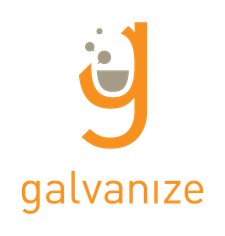

---

# Admissions Process Description

## Technical Exercise sent via email (3 questions)

1. The Python question will just be a basic programming task testing your ability to structure a program. You can solve it without any special libraries.
2. The SQL material is all about querying. We will provide an outline of tables, and then you will have to write a query to pull information from these tables.
3. The statistics question is based on hypothesis testing.

## Python Interview via Google Hangout

This is a technical interview where you will solve a challenge problem in Python. It is conducted by a Data Science alum or instructor, via Google Hangout. You will use a collaborative code editor so the instructor can observe you as you work through the problem(s). The candidate should be familiar with all of the basic data structures in python, and basic control flow/logical statements. The candidate should be capable of writing simple functions in Python.

## Statistics Interview via Google Hangout

The interview is conducted by an instructor or alum, via Google Hangout. There will be no software or programming, questions will be shared over chat and then worked through with the interviewer. You should be familiar with college level stats and probability concepts. Topics reviewed include model fitting, regression analysis, probability, etc. You should:

* Have an understanding of probability, probability distributions, hypothesis testing, and confidence intervals
* Have experience with statistical modeling and a good understanding of basic visual methods and model evaluation.

After the final interview, an Admissions decision will then be made within 1-2 business days.

**NOTE**:  As tempting as it is to ask the interviewer whether you passed, they have been instructed to leave that final judgement to the admissions officer.  Feel free, however, to ask your interviewer where you could improve and bring up any questions you have about the immersive!
